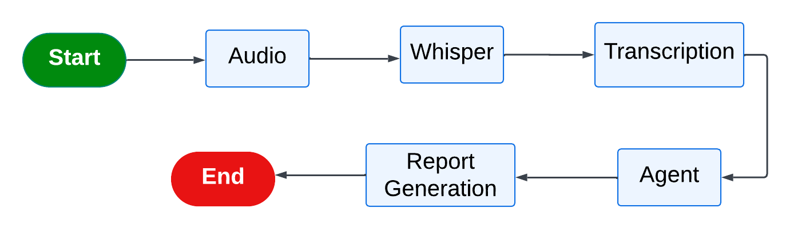

# Audio Analyzer



## Overview
Audio Analyzer is a production-ready system for automated audio transcription and analysis. It leverages advanced agents and tasks to process audio files, extract transcriptions, and perform customizable analyses. The system is modular, scalable, and suitable for integration into larger data pipelines or standalone use.

## Features
- Automated audio transcription
- Flexible analysis modules
- Agent-based architecture for extensibility
- Configuration via environment variables and config files
- Docker support for easy deployment
- Poetry for dependency management
- Comprehensive test suite

## Project Structure
```
├── src/audio_analyzer/
│   ├── agents.py         # Agent logic for processing
│   ├── analysis.py       # Audio analysis routines
│   ├── app.py            # Main application entrypoint
│   ├── config.py         # Configuration management
│   ├── schemas.py        # Data schemas
│   ├── tasks.py          # Task orchestration
│   ├── transcription.py  # Transcription logic
│   └── __init__.py
├── tests/                # Test suite
├── Dockerfile            # Containerization
├── pyproject.toml        # Poetry project config
├── poetry.lock           # Dependency lock file
├── .env                  # Environment variables
├── flow.png              # System flow diagram
└── README.md             # Project documentation
```

## Installation
1. Clone the repository:
   ```bash
   git clone <repo_url>
   cd audio_analyzer
   ```
2. Install dependencies with Poetry:
   ```bash
   poetry install
   ```
3. Configure environment variables in `.env` as needed.

## Usage
Run the main application:
```bash
cd src/audio_analyzer/
uvicorn app:app
```

## Testing
Run all tests:
```bash
poetry run pytest tests/
```

## Docker
Build and run the container:
```bash
# Build
docker build -t audio-analyzer .
# Run
docker run --env-file .env audio-analyzer
```

## Configuration
- Edit `src/audio_analyzer/config.py` or `.env` for custom settings.

## Contributing
Pull requests and issues are welcome. Please ensure code is tested and documented.

